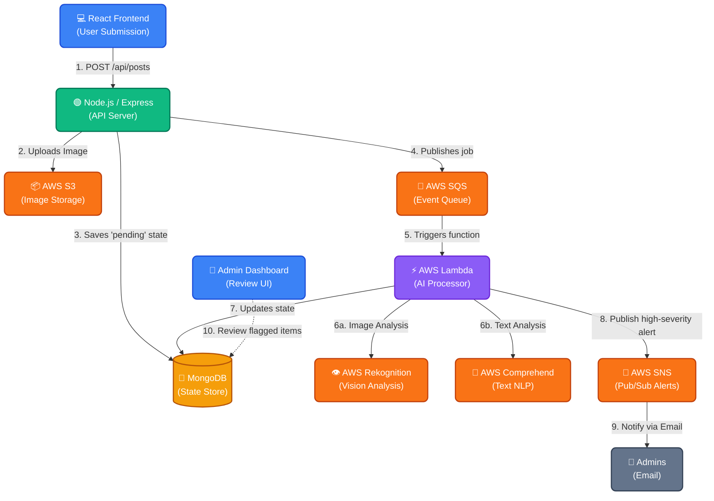

# AI Content Moderation Platform

A full-stack, event-driven content moderation platform that leverages AWS AI services (Rekognition & Comprehend) to automatically analyze user-generated text and image content. Built to reduce manual review overhead by flagging toxic, explicit, or highly negative content in real-time.

## Architecture Overview

This platform utilizes an event-driven, microservices-oriented architecture to handle content moderation asynchronously. This ensures that the user-facing application remains highly responsive, while computationally heavy AI processing happens in the background.



### Data Flow

1. **Submission**: A user submits text and an optional image via the React Frontend.
2. **Ingestion**: The Node.js/Express API receives the payload. It uploads the image directly to **AWS S3** and persists the initial post record in **MongoDB** with a `pending` status.
3. **Queueing**: The API pushes a moderation job event containing the Post ID to **AWS SQS** and immediately returns a success response to the client.
4. **Processing**: An **AWS Lambda** function is triggered by the SQS event source mapping. It retrieves the post and coordinates the analysis:
    - Text is sent to **AWS Comprehend** for sentiment analysis and PII detection.
    - Images are sent to **AWS Rekognition** for explicit content and violence detection.
5. **Resolution**: Lambda aggregates the AI verdicts and updates the document in MongoDB. The post status transitions to `clean`, `needs_review`, or `flagged`.
6. **Alerting**: If the AI detects a high-severity violation (e.g. >90% confidence of illicit content), Lambda publishes a message to **AWS SNS**, which dispatches real-time alerts to the moderation team via Email.
7. **Review**: The moderation team uses the Admin Dashboard to review the flagged content and manually override or approve the AI's decision.

## Tech Stack

- **Frontend:** React (Vite), TypeScript, Tailwind CSS, Recharts, React Router
- **Backend:** Node.js, Express, TypeScript, Mongoose
- **Database:** MongoDB
- **Cloud/Infra (AWS):** S3, SQS, Lambda, SNS, Rekognition, Comprehend
- **Infrastructure as Code:** Terraform

## Setup Instructions

### 1. Prerequisites
- Node.js (v18+)
- Terraform installed
- AWS CLI configured with active credentials
- A MongoDB cluster (e.g., MongoDB Atlas)

### 2. Infrastructure Setup
Navigate to the `infra` folder and deploy the AWS resources:
```bash
cd infra
terraform init
terraform apply -var="mongodb_uri=YOUR_MONGODB_URI" -var="admin_email=YOUR_EMAIL"
```
*Note: Make sure to check your email and confirm the SNS subscription!*

### 3. Environment Variables
Copy `.env.example` to `.env` in the root directory and fill in your details:
```bash
cp .env.example .env
```

### 4. Build and Run
**Start the Backend:**
```bash
cd server
npm install
npm run dev
```

**Start the Frontend:**
```bash
cd client
npm install
npm run dev
```

### 5. Lambda Deployment
If you make changes to the Lambda processor:
```bash
cd lambda
npm install
npm run zip
cd ../infra
terraform apply -var="mongodb_uri=YOUR_MONGODB_URI"
```

## Results

*This section highlights the business impact of the platform during testing/production.*

- **Manual Review Reduction:** Reduced manual review time by __X%__.
- **AI/Human Agreement Rate:** Achieved a __Y%__ AI accuracy rate (where human admins agreed with the AI's final verdict).
- **Average Resolution Time:** High-severity content is now processed and alerted within __Z seconds__.
